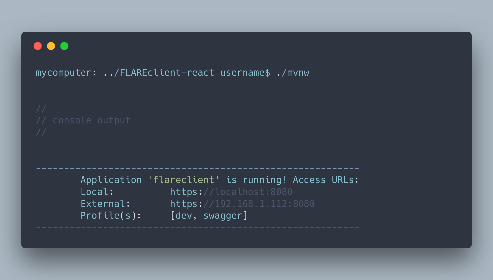

# FLAREclient
This application was initially generated using JHipster 5.2.1, you can find documentation and help [here](https://www.jhipster.tech/documentation-archive/v5.2.1).

## Getting Started

Before you begin **development** on this project you will need to meet these prerequisites in your development environment.

- Install the listed FLARE projects as they are dependencies of the FLAREclient (Branches listed are as of December 17 2018. This will updated as branches are merged, and the application is closer to delivery.)
  - [javaTAXII2](https://git.ecicd.dso.ncps.us-cert.gov/fireteam/javaTAXII2/tree/develop/) - `develop` branch
    - To make sure this is properly installed as a dependency for the client run a `mvn install` or `mvn install -DskipTests` to save some time.
  - [FLAREutils](https://git.ecicd.dso.ncps.us-cert.gov/fireteam/bcmc/FLAREutils) - `master` branch
    - To make sure this is properly installed as a dependency for the client run a `mvn install` or `mvn install -DskipTests` to save some time.

- Install the following development tools in order to run the client locally for development.
  - [Docker](https://www.docker.com/get-started) to house the Mongo instance that interacts with the client during development.   

- You will need our admin certificate to be able to hit the api endpoints within the client found [here](https://cybershare.atlassian.net/wiki/spaces/devspace/pages/172949587/FLAREcloud+-+Client+Certificate). Get the password from a teammate to unzip it.

## Running FLAREclient Locally

After installing all of the prerequisites, you should be able to now run FLAREclient locally. To begin you will need to run the MongoDB instance in docker and expose port `27017`. If this is your first time setting up the client, run

    docker run -p 127.0.0.1:27017:27017 -d mongo

If this in not your first time running the above command, you should run check for existing mongo containers using

    docker ps -a

Get the ID of an existing mongo instance in order to prevent creating unnecessary containers / using unnecessary resources on your computer. With the id, run

    docker start #### 

where `####` is the first four characters of your container's ID.

...

## Building

To build the flareclient application run:

    mvn clean package

To ensure everything worked, run:

    java -jar target/*.jar

Then navigate to [http://localhost:8080](http://localhost:8080) in your browser.

## Testing

To launch your application's tests, run:

    mvn clean test

## Using Docker to simplify development (optional)

You can use Docker to improve your JHipster development experience. A number of docker-compose configuration are available in the [src/main/docker](src/main/docker) folder to launch required third party services.

For example, to start a mongodb database in a docker container, run:

    docker-compose -f docker/mongodb.yml up -d

To stop it and remove the container, run:

    docker-compose -f docker/mongodb.yml down

You can also fully dockerize your application and all the services that it depends on.
To achieve this, first build a docker image of your app by running:

    mvn clean package docker:build

Then run:

    docker-compose -f docker/app.yml up -d

For more information refer to [Using Docker and Docker-Compose][], this page also contains information on the docker-compose sub-generator (`jhipster docker-compose`), which is able to generate docker configurations for one or several JHipster applications.

