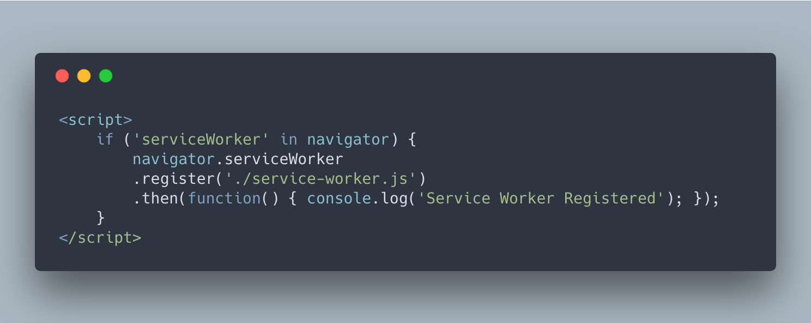

# FLAREclient
This application was generated using JHipster 5.2.1, you can find documentation and help [here](https://www.jhipster.tech/documentation-archive/v5.2.1).

## Getting Started

Before you begin **development** on this project you will need to meet these prerequisites in your development environment.

- Install the listed FLARE projects as they are dependencies of the FLAREclient (Branches listed are as of December 17 2018. This will updated as branches are merged, and the application is closer to delivery.)
  - [javaTAXII2](https://github.com/bcmc/javaTAXII2/tree/develop/) - `develop` branch
    - To make sure this is properly installed as a dependency for the client run a `mvn install` or `mvn install -DskipTests` to save some time.
  - [FLAREutils](https://github.com/bcmc/FLAREutils) - `master` branch
    - To make sure this is properly installed as a dependency for the client run a `mvn install` or `mvn install -DskipTests` to save some time.

- Install the following development tools in order to run the client locally for development.
  - [Docker](https://www.docker.com/get-started) to house the Mongo instance that interacts with the client during development.   
  - [Node.js][] (version 11.x.x, installation errors ocurred with 12.6.0). We use Node to run a development web server and build the project. Depending on your system, you can install Node either from source or as a pre-packaged bundle.
  - [Yarn][] to manage Node dependencies. Depending on your system, you can install Yarn either from source or as a pre-packaged bundle.

- You will need our admin certificate to be able to hit the api endpoints within the client found [here](https://cybershare.atlassian.net/wiki/spaces/devspace/pages/172949587/FLAREcloud+-+Client+Certificate). Get the password from a teammate to unzip it.

## Running FLAREclient Locally

After installing all of the prerequisites, you should be able to now run FLAREclient locally. To begin you will need to run the MongoDB instance in docker and expose port `27017`. If this is your first time setting up the client, run

    docker run -p 127.0.0.1:27017:27017 -d mongo

If this in not your first time running the above command, you should run check for existing mongo containers using

    docker ps -a

Get the ID of an existing mongo instance in order to prevent creating unnecessary containers / using unnecessary resources on your computer. With the id, run

    docker start #### 

where `####` is the first four characters of your container's ID.

Next in the project folder for FLAREclient, run

      yarn install

to install the node modules (front end dependencies) for the application. We use yarn scripts and [Webpack][] as our build system. This will launch a browser window with the client but do not use this one for development. Use the localhost address that results from the following command.

Next run the `./mvnw` script to in the root of the project to install Maven dependencies and run other build processes. The result of a successful run should look as follows.

Lastly to run the application use `yarn start` and enjoy a blissful development experience where your browser
auto-refreshes when files change on your hard drive.

[Yarn][] is also used to manage CSS and JavaScript dependencies used in this application. You can upgrade dependencies by
specifying a newer version in [package.json](package.json). You can also run `yarn update` and `yarn install` to manage dependencies.
Add the `help` flag on any command to see how you can use it. For example, `yarn help update`.

The `yarn run` command will list all of the scripts available to run for this project.

### Service workers

Service workers are commented by default, to enable them please uncomment the following code.

* The service worker registering script in index.html

Note: workbox creates the respective service worker and dynamically generate the `service-worker.js`

### Managing dependencies

For example, to add [Leaflet][] library as a runtime dependency of your application, you would run following command:

    yarn add --exact leaflet

To benefit from TypeScript type definitions from [DefinitelyTyped][] repository in development, you would run following command:

    yarn add --dev --exact @types/leaflet

Then you would import the JS and CSS files specified in library's installation instructions so that [Webpack][] knows about them:
Note: there are still few other things remaining to do for Leaflet that we won't detail here.

For further instructions on how to develop with JHipster, have a look at [Using JHipster in development][].

## Building for production

To optimize the flareclient application for production, run:

    ./mvnw -Pprod clean package

This will concatenate and minify the client CSS and JavaScript files. It will also modify `index.html` so it references these new files.
To ensure everything worked, run:

    java -jar target/*.war

Then navigate to [http://localhost:8080](http://localhost:8080) in your browser.

Refer to [Using JHipster in production][] for more details.

## Testing

To launch your application's tests, run:

    ./mvnw clean test

### Client tests

Unit tests are run by [Jest][] and written with [Jasmine][]. They're located in [src/test/javascript/](src/test/javascript/) and can be run with:

    yarn test

For more information, refer to the [Running tests page][].

## Using Docker to simplify development (optional)

You can use Docker to improve your JHipster development experience. A number of docker-compose configuration are available in the [src/main/docker](src/main/docker) folder to launch required third party services.

For example, to start a mongodb database in a docker container, run:

    docker-compose -f src/main/docker/mongodb.yml up -d

To stop it and remove the container, run:

    docker-compose -f src/main/docker/mongodb.yml down

You can also fully dockerize your application and all the services that it depends on.
To achieve this, first build a docker image of your app by running:

    ./mvnw verify -Pprod dockerfile:build dockerfile:tag@version dockerfile:tag@commit

Then run:

    docker-compose -f src/main/docker/app.yml up -d

For more information refer to [Using Docker and Docker-Compose][], this page also contains information on the docker-compose sub-generator (`jhipster docker-compose`), which is able to generate docker configurations for one or several JHipster applications.

## Continuous Integration (optional)

To configure CI for your project, run the ci-cd sub-generator (`jhipster ci-cd`), this will let you generate configuration files for a number of Continuous Integration systems. Consult the [Setting up Continuous Integration][] page for more information.

[JHipster Homepage and latest documentation]: https://www.jhipster.tech
[JHipster 5.2.1 archive]: https://www.jhipster.tech/documentation-archive/v5.2.1

[Using JHipster in development]: https://www.jhipster.tech/documentation-archive/v5.2.1/development/
[Using Docker and Docker-Compose]: https://www.jhipster.tech/documentation-archive/v5.2.1/docker-compose
[Using JHipster in production]: https://www.jhipster.tech/documentation-archive/v5.2.1/production/
[Running tests page]: https://www.jhipster.tech/documentation-archive/v5.2.1/running-tests/
[Setting up Continuous Integration]: https://www.jhipster.tech/documentation-archive/v5.2.1/setting-up-ci/

[Node.js]: https://nodejs.org/
[Yarn]: https://yarnpkg.org/
[Webpack]: https://webpack.github.io/
[Angular CLI]: https://cli.angular.io/
[BrowserSync]: http://www.browsersync.io/
[Jest]: https://facebook.github.io/jest/
[Jasmine]: http://jasmine.github.io/2.0/introduction.html
[Protractor]: https://angular.github.io/protractor/
[Leaflet]: http://leafletjs.com/
[DefinitelyTyped]: http://definitelytyped.org/
